# Waver — Usage Manual

An illustrated guide to every user-facing feature of the `<wave-r>` component, captured from the
demo app (`index.html` + `src/demo/main.ts`).

For installation and framework wrappers (vanilla/React/Vue), see the [README](../README.md). For
the full API reference (options, methods, events), see [`./api.md`](./api.md).

---

## Getting oriented

The demo page wraps a single `<wave-r>` element with a row of controls (Play/Stop, Zoom to full,
Toggle spectrogram, Reset, Toggle button labels, a record-mode selector, and an input-device
picker) and a status line above it for error/recording messages.

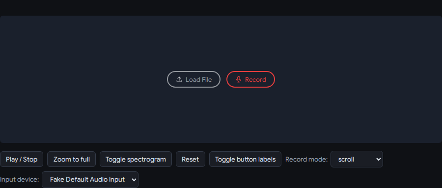

---

## Loading audio

Two ways to get audio into a Waver instance: the built-in **Load File** button (opens a native
file picker wired to `<input type="file">`), or programmatically via `loadAudioBuffer()` /
`loadSamples()`. Until audio is loaded, the component shows an empty-state overlay with Load File,
Monitor, and Record buttons — each independently configurable via the `loadButton`/`monitorButton`/
`recordButton` options (`"enabled" | "disabled" | "hidden"`).


Set `hideButtonLabels: true` (or click the demo's "Toggle button labels" button) to show icon-only
buttons — both keep a static `aria-label` for accessibility regardless of this setting.


Once a file decodes successfully, the empty-state overlay disappears and the waveform renders with
the ruler strip and minimap:

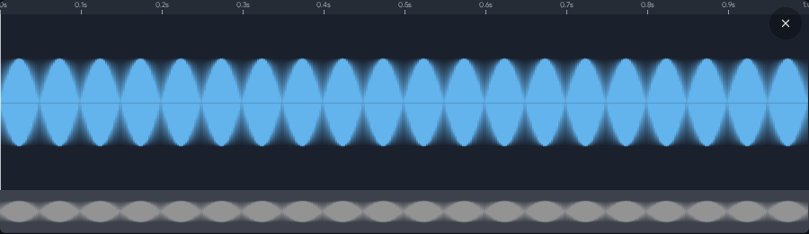

### Error states

A file that fails to decode (corrupt/unsupported audio) fires `waver:loaderror` with the underlying
`Error`; the empty-state buttons remain visible so the user can retry:

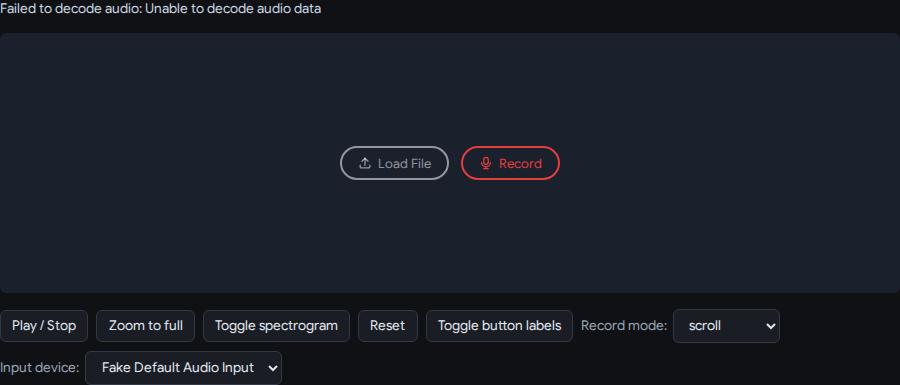

---

## Selection

**Click-drag** on the waveform body creates a selection (also used as the playback loop range).
**Drag an edge** to resize it, **drag the body** to move it, **double-click** to clear it. A plain
click (no drag) instead moves the cursor — and seeks playback if already playing.

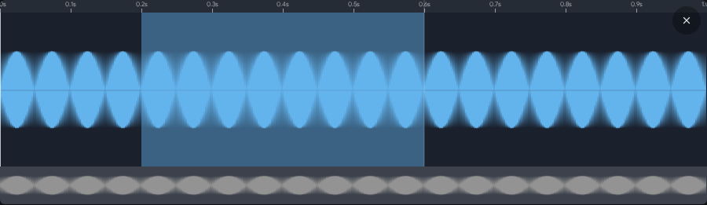

Selection changes fire `waver:selectionchange` continuously during a drag, and
`waver:selectionchanged` / `waver:selectionreset` once the change settles.

---

## Playback

Playback runs through the native Web Audio API (`play()` / `stop()` / `togglePlayback()`, wired to
the demo's "Play / Stop" button). The cursor (playhead) advances during playback and fires
`waver:cursorchange` continuously; `waver:play` / `waver:stop` mark start/end, and `waver:loop`
fires each time playback loops back to the selection start.

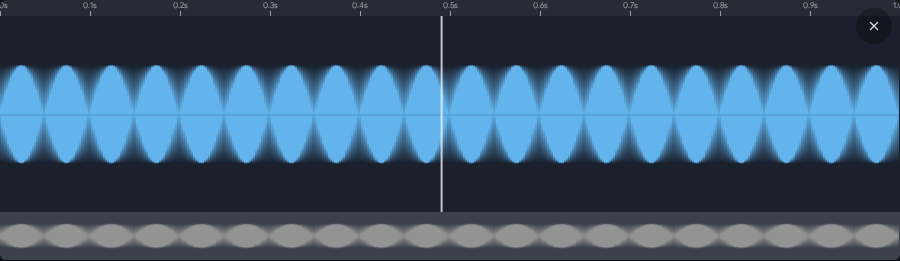

---

## Zoom & pan

- **Mouse wheel**: zoom in/out, pivoting on the cursor.
- **Ctrl + wheel**: pan (scroll) the waveform.
- **Ctrl + Shift + wheel**: pan faster.
- **Touch**: two-finger pinch to zoom (pivoting on the pinch midpoint), two-finger swipe to pan.

Zoom ranges from 100% (whole buffer) down to single-sample resolution. `setZoom({ samplesPerPixel,
offsetSample }, animate = true)` sets it programmatically (eased unless `animate: false`);
`zoomToFull()` resets to fit the entire waveform.

Deep zoom, showing individual sample-level detail:

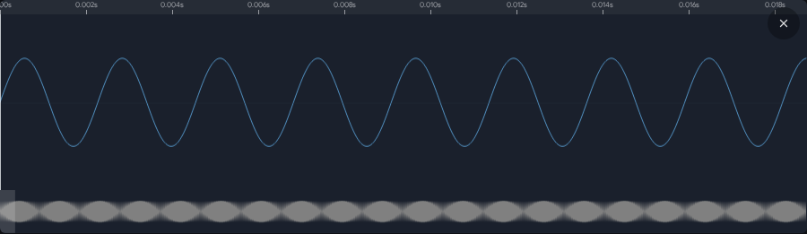

The same buffer zoomed to fit fully (`zoomToFull()` / the demo's "Zoom to full" button):

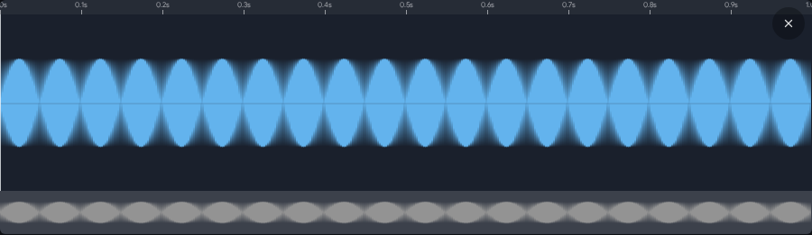

---

## View modes: waveform vs. spectrogram

`setViewMode("waveform" | "spectrogram")` (or `configure({ viewMode })`) switches the main view;
the minimap always stays on the waveform regardless. Spectrogram analysis (windowed FFT across the
whole buffer) runs lazily off the main thread across several Web Workers the first time you switch
in, and is cached per buffer/resolution afterward. While analysis is in flight the view shows a
"Calculating spectrogram…" placeholder — listen for `waver:spectrogramready` to know when it's
safe to capture/react.

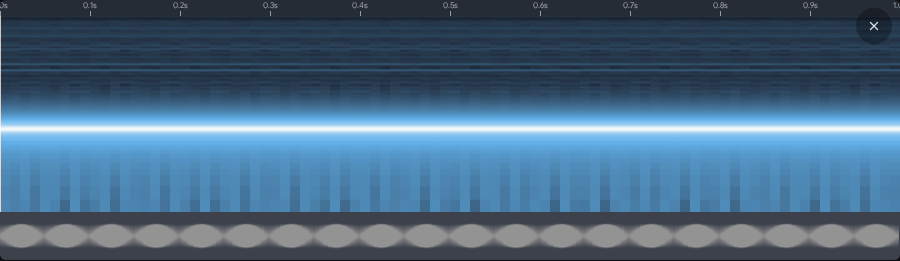

---

## Minimap

A strip beneath the main view (height controlled by `minimapHeightRatio`, hide via
`showMinimap: false`) showing the whole buffer with a viewport-overlay rectangle marking the
currently visible zoom window. Click/drag on it pans the main viewport, centered on the pointer
(animated).

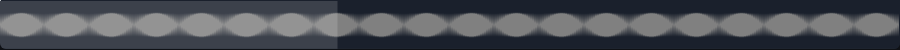

---

## Ruler

A dedicated strip above the waveform (toggle via `showRuler`, height via `rulerHeight`) for
repositioning the cursor without touching selection state — click/drag on it moves the cursor and,
if already playing, seeks playback there. Labels use `rulerTimeFormat`: `"time"` (hh:mm:ss / mm:ss
/ ss, the default) or `"samples"` (raw sample index).

**Time format** (default):

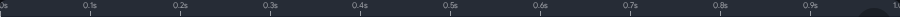

**Samples format**:

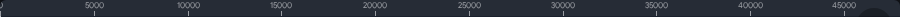

---

## Monitoring

The **Monitor** button opens the microphone for live level metering without recording, displaying a
VU meter on the left edge of the component. Click it again (or press Escape) to close the meter and
disconnect the mic. Monitoring fires `waver:monitorstart` / `waver:monitorstop` events; use the
`startMonitoring()` / `stopMonitoring()` / `isMonitoring()` methods for programmatic control.
When the Record button is clicked while monitoring, monitoring automatically stops and recording
begins.

---

## Recording

Clicking the built-in **Record** button (or calling `startRecording()`) prompts for mic access and
starts capturing; the empty-state overlay is replaced by a centered readout — pulsing dot, elapsed
time, and a **Stop** button. Clicking Stop (or `stopRecording()`) ends capture and loads the
recorded audio in place, same as picking a file. Recording fires `waver:recordstart` / `waver:recordstop` /
`waver:recordsuccess` events.

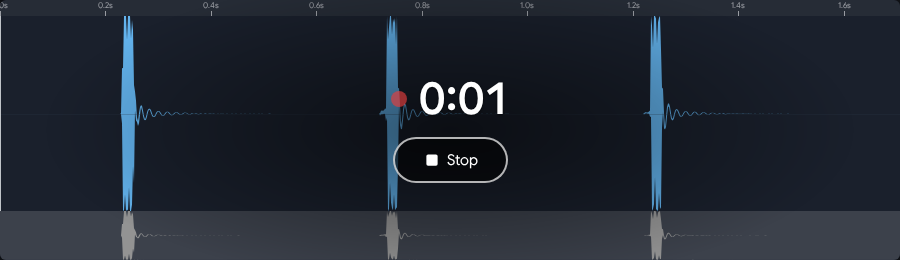

While capturing, the viewport follows `recordViewMode` (ignored during playback, and all manual
zoom/pan/seek is locked during recording since auto-follow would immediately override it):

- **`"scroll"`** (default, shown above) — spans 0 → record head until it outgrows
  `recordWindowSeconds`, then slides a fixed-width window that keeps following the head.
- **`"zoom-out"`** — always spans 0 → record head, compressing the visible waveform horizontally as
  the recording grows, so the whole capture-so-far stays visible at all times.
- **`"flat"`** — draws no waveform while capturing (just the recording-bar readout); useful when you
  want the overlay UI without the rendering cost of a live waveform.

  `"zoom-out"` and `"flat"` are switchable live via the demo's "Record mode" selector but aren't
  screenshotted separately here — their effect is a difference in horizontal scaling/rendering
  behavior during capture rather than a distinct static visual, and is fully described above.

Set `recordButton: "disabled"` to grey out (but keep visible) the Record button on other instances
while one is actively recording — useful when several Waver instances share a single mic and only
one may record at a time. Stereo/multichannel sources use `channelIndex` (config option or
`startRecording()`'s second argument) to pick which channel is kept; the loaded audio retains all
channels and is accessible via `getChannelCount()` / `getChannels()`.

---

## Built-in buttons & their states

| Button | Shown when | Options |
|---|---|---|
| Load File | No audio loaded | `loadButton`: `"enabled" \| "disabled" \| "hidden"` |
| Monitor | No audio loaded | `monitorButton`: `"enabled" \| "disabled" \| "hidden"` |
| Record | No audio loaded | `recordButton`: `"enabled" \| "disabled" \| "hidden"` |
| Cancel (×) | Audio loaded | `cancelButton`: `"enabled" \| "disabled" \| "hidden"` |
| Stop | While recording | (no dedicated option — tied to recording state) |

The Cancel button (top-right once audio is loaded) opens a confirmation overlay before discarding
via `reset()`:

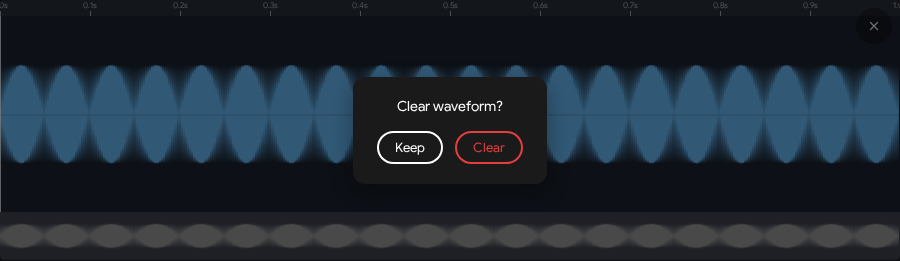

Choosing **Keep** dismisses the dialog with no change; **Clear** calls `reset()`, erasing the
loaded/recorded audio and returning to the empty-button state (also cancels an in-progress
recording, if any). `hasAudio()` reports whether audio is currently loaded.

---

## Theming

Pass theme overrides via `configure({ theme })` (or the `theme` prop in React/Vue), merged onto the
base dark theme. Two built-in themes ship as named exports: `darkTheme` (default) and `lightTheme`.
Fields include `waveformColor`, `backgroundColor`, `cursorColor`, `selectionColor` (auto-derived
from `waveformColor` if unset), `minimapOverlayColor`, `zeroLineColor`, `rulerColor`, `fontFamily`
(with optional `googleFont` injection), `roundedCorners`/`borderRadius`, and `spectrogramColors`
(gradient stops for the spectrogram colormap).

**Dark theme** (default):


**Light theme** (`configure({ theme: lightTheme })`):

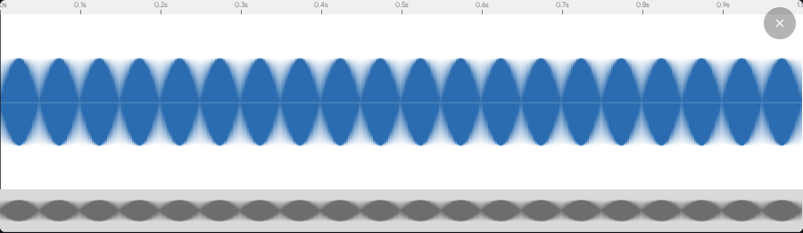

---

## Interaction reference

- **Waveform body**: click-drag to create a selection; drag a selection edge to resize; drag the
  selection body to move it; double-click to clear it; plain click (no drag) moves the cursor (and
  seeks playback if already playing).
- **Ruler strip**: click/drag to move the cursor and, if already playing, seek playback there —
  without touching selection state.
- **Mouse wheel**: zoom in/out, pivoting on the cursor.
- **Ctrl + wheel**: scroll (pan) the waveform.
- **Ctrl + Shift + wheel**: scroll faster.
- **Minimap**: click/drag to pan the main viewport, centered on the pointer (animated).
- **Touch**: two-finger pinch to zoom (pivoting on the pinch midpoint), two-finger swipe to pan.
  Single-finger touch drives the same selection/cursor gestures as mouse. All interaction is locked
  while a recording is in progress (see Recording, above).

---

## Regenerating these screenshots

Screenshots are captured by `scripts/take-screenshots.ts`, a standalone Playwright script (kept
outside `e2e/` so it's never picked up by `npm run e2e`). Run it with:

```bash
npm run screenshots
```

It launches chromium against the demo app on port 4173 (fake mic device flags enabled, same as the
e2e suite), clears `docs/screenshots/` (preserving `PLAN.md`), and re-captures every shot in this
manual. See `docs/screenshots/PLAN.md` for the full shot-by-shot capture plan.
